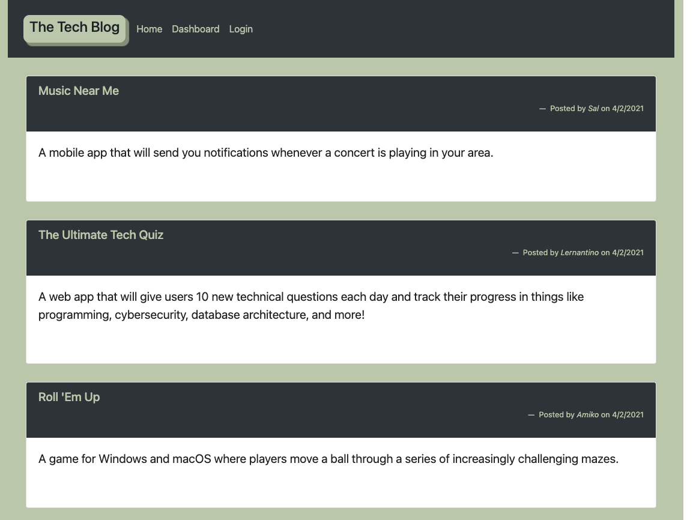

# Tech-Blog

## Description 

* The Tech_Blog is a simple blogging site where users can read and comment on other's posts as well as add or delete posts of their own.

# Installation

If you are installing locally, please create the database in schema.sql file, then seed using the command "node seeds/seed.js" After that, run "npm start" to start the server. You can then use the app locally. When the app is deployed to Heroku you can follow the link listed below to the site. A signup is required to enjoy all the features of the site.

## Credits

* The application utilizes Express handlebars, Sequalize, JavaScript in front and backend.
* The application  followsthe Model-View-Controller (MVC) paradigm.
* It allows users to create an account and sign in to post a tech posts.

## Screenshot

## Links

[ This is the link to Heroku site](https://www.google.com)

[This is the link to GitHub repository](https://www.google.com)

## Questions

If you have questions contact me on [GitHub](https://jamirov.github.io/) or contact Jasur at ajasur@gmail.com.